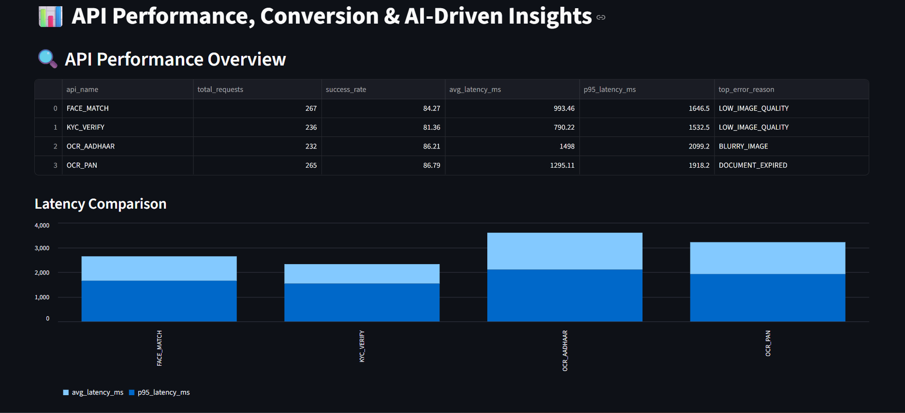
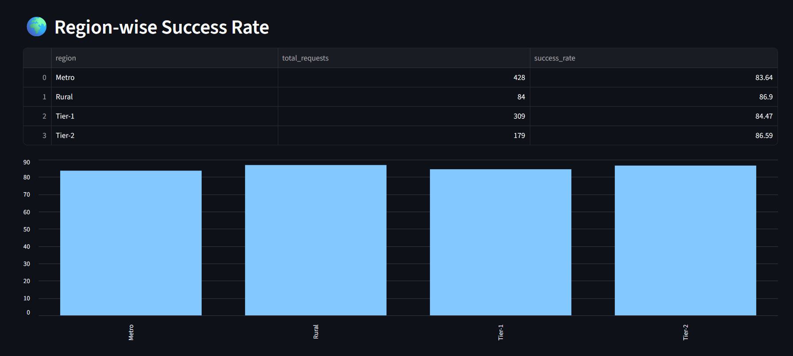
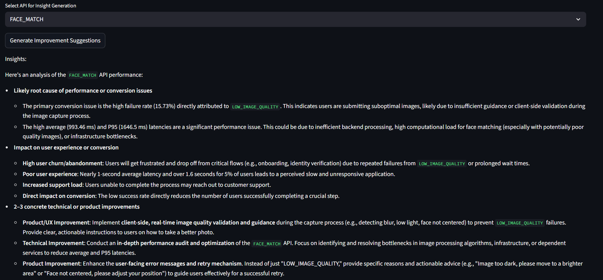

# 📊 API Analytics Dashboard for Product Analysts

> **AI-Powered Analytics Platform for FinTech API Performance & Conversion Optimization**

A comprehensive analytics solution designed specifically for Product Analysts working with API-driven products. This platform transforms raw API logs into actionable insights using data aggregation, visualization, and AI-powered recommendations to drive product decisions and improve conversion rates.

---

## 🎯 Overview

As a Product Analyst in a FinTech environment, understanding API performance and its impact on user conversion is critical. This project provides:

- **Performance Monitoring**: Track API latency, success rates, and error patterns
- **Conversion Analysis**: Understand how API performance affects user funnels
- **Regional Insights**: Identify geographic performance variations
- **AI-Powered Recommendations**: Get actionable product improvements from Gemini AI

---

## 🚀 Key Features

### 1. **API Performance Analytics**
Monitor critical API metrics that directly impact user experience:
- Request volume and success rates
- Average and P95 latency measurements
- Error reason identification and frequency
- API-by-API performance comparison



### 2. **Conversion Funnel Analysis**
Understand the relationship between API performance and conversion:
- Request-to-success conversion rates
- Drop-off point identification
- API-specific conversion metrics


### 3. **Regional Performance Insights**
Analyze geographic variations in API performance:
- Region-wise success rates
- Geographic bottleneck identification
- Infrastructure optimization opportunities



### 4. **AI-Generated Product Insights**
Leverage Gemini AI for intelligent product recommendations:
- Root cause analysis of performance issues
- Impact assessment on user experience
- Concrete technical and product improvement suggestions
- Tailored recommendations for each API



---

## 📁 Project Structure

```
api-analytics/
├── ai/                          # AI insights generation
│   └── insight_Ai.py           # Gemini AI integration for recommendations
├── dashboard/                   # Streamlit visualization
│   └── app.py                  # Interactive dashboard
├── python/                      # Data processing & aggregation
│   ├── aggregate_metrics.py    # Core metrics calculation
│   ├── api_metrics.csv         # Generated API metrics
│   ├── funnel_metrics.csv      # Generated conversion data
│   └── region_metrics.csv      # Generated regional data
├── querypart/                   # Data source
│   └── api_logs_myql.csv       # Raw API logs
├── generate/                    # Data generation utilities
│   ├── generatelogs.py         # Log generation script
│   └── raw_logs.csv            # Generated raw logs
└── pics/                        # Dashboard screenshots
```

---

## 🛠️ Technology Stack

- **Python 3.12**: Core programming language
- **Pandas**: Data manipulation and aggregation
- **Streamlit**: Interactive dashboard framework
- **Google Gemini AI**: AI-powered insights generation
- **NumPy**: Statistical calculations

---

## 📋 Prerequisites

- Python 3.12 or higher
- Google Gemini API key (for AI insights)
- Required Python packages (see Installation)

---

## ⚙️ Installation

1. **Clone the repository**
   ```bash
   git clone https://github.com/sanjayy-gowdaa/api-analytics.git
   cd api-analytics
   ```

2. **Install dependencies**
   ```bash
   pip install pandas numpy streamlit google-generativeai python-dotenv
   ```

3. **Set up environment variables**
   
   Create a `.env` file in the root directory:
   ```env
   GEMINI_API_KEY=your_gemini_api_key_here
   ```

4. **Prepare your data**
   
   Ensure your API logs are in the correct format in `querypart/api_logs_myql.csv`:
   ```csv
   request_id,api_name,TIMESTAMP,latency_ms,status_Code,document_type,region,device_type,error_reason
   ```

---

## 🚀 Usage

### Step 1: Generate Aggregated Metrics

Run the metrics aggregation script to process raw API logs:

```bash
cd python
python aggregate_metrics.py
```

This generates three CSV files:
- `api_metrics.csv`: API performance metrics
- `funnel_metrics.csv`: Conversion funnel data
- `region_metrics.csv`: Regional performance data

### Step 2: Launch the Dashboard

Start the Streamlit dashboard:

```bash
cd dashboard
streamlit run app.py
```

The dashboard will open in your browser at `http://localhost:8501`

### Step 3: Generate AI Insights

1. Select an API from the dropdown menu
2. Click "Generate Improvement Suggestions"
3. Review AI-powered recommendations for product improvements

---

## 📊 Metrics Calculated

### API Performance Metrics
- **Total Requests**: Volume of API calls
- **Success Rate**: Percentage of successful requests (status code 200)
- **Average Latency**: Mean response time in milliseconds
- **P95 Latency**: 95th percentile latency (performance consistency)
- **Top Error Reason**: Most common failure cause

### Conversion Metrics
- **Conversion Rate**: Percentage of successful requests per API
- **Successful Requests**: Count of successful calls
- **Drop-off Analysis**: Failed request patterns

### Regional Metrics
- **Success Rate by Region**: Geographic performance variations
- **Request Distribution**: Regional traffic patterns

---

## 🤖 AI Insights Features

The AI-powered insights module provides:

1. **Root Cause Analysis**: Identifies likely causes of performance degradation or conversion issues
2. **Impact Assessment**: Evaluates effects on user experience and business metrics
3. **Actionable Recommendations**: Provides 2-3 concrete technical or product improvements
4. **Context-Aware Suggestions**: Tailored to each API's specific metrics and failure patterns

---

## 📈 Use Cases for Product Analysts

### 1. **Performance Optimization**
- Identify slow APIs impacting user experience
- Prioritize optimization efforts based on P95 latency
- Track performance improvements over time

### 2. **Conversion Rate Optimization**
- Correlate API failures with conversion drops
- Identify friction points in user journeys
- A/B test API improvements impact

### 3. **Product Roadmap Planning**
- Use AI recommendations for feature prioritization
- Data-driven decision making for technical debt
- Resource allocation based on impact analysis

### 4. **Stakeholder Communication**
- Visual dashboards for executive presentations
- Clear metrics for engineering team alignment
- ROI justification for infrastructure investments

---

## 🔧 Customization

### Modify Metrics Calculations

Edit `python/aggregate_metrics.py` to add custom metrics:

```python
# Example: Add median latency
api_metrics = df.groupby("api_name").agg(
    median_latency=("latency_ms", "median")
)
```

### Customize AI Prompts

Edit `ai/insight_Ai.py` to adjust AI analysis focus:

```python
prompt = f"""
Your custom prompt here with {row['api_name']} metrics...
"""
```

### Extend Dashboard Visualizations

Edit `dashboard/app.py` to add new charts or sections:

```python
st.header("Your Custom Analysis")
st.line_chart(your_data)
```

---

## 📝 License

This project is open source and available under the MIT License.

---

## 👨‍💻 Author

**Sanjay Gowda**
- GitHub: [@sanjayy-gowdaa](https://github.com/sanjayy-gowdaa)

---
